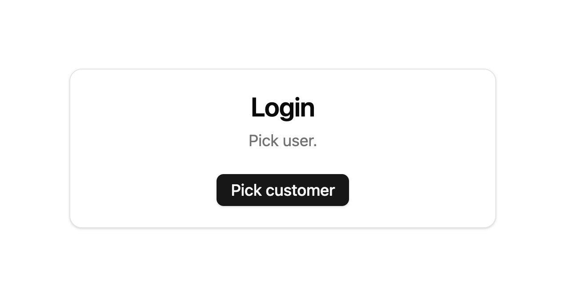
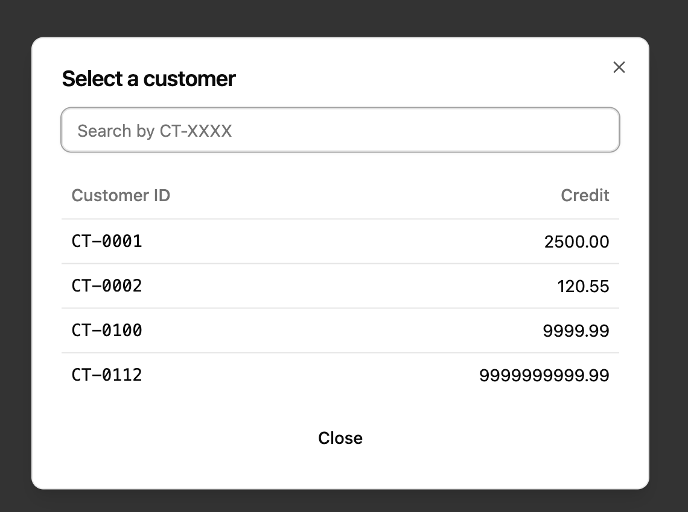
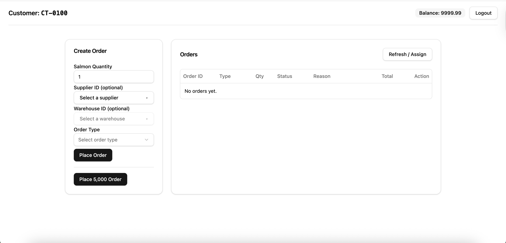
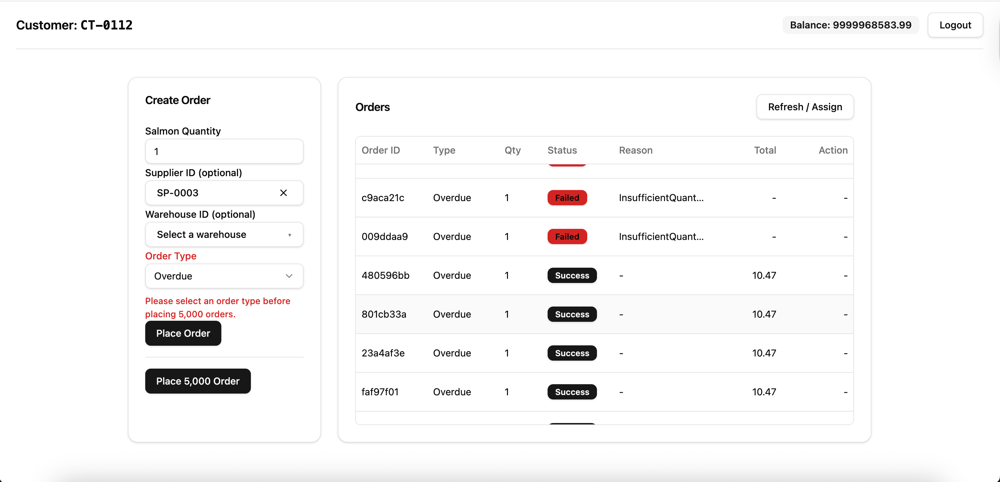
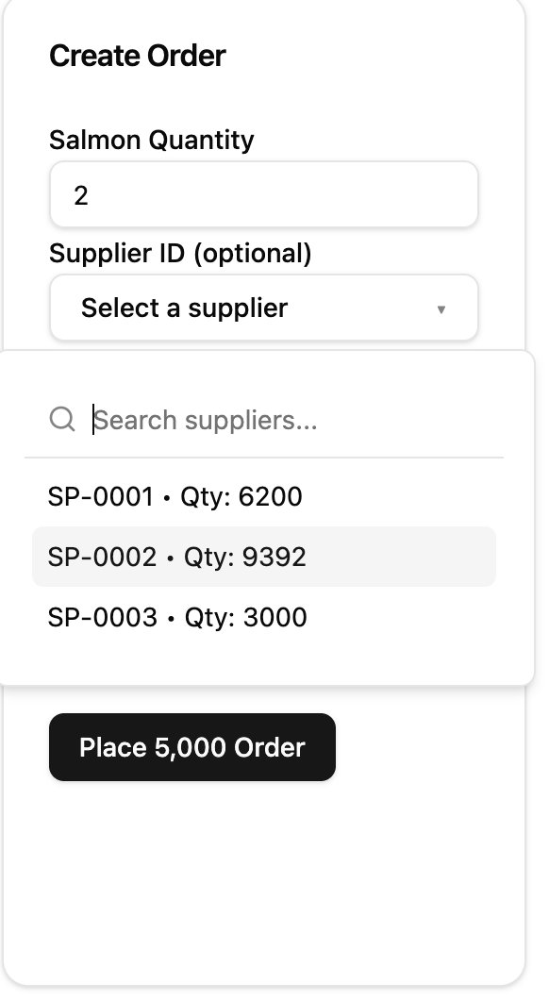

# Theerapat K. — Balerion Frontend Assignment

This project is deployed on Vercel and can be accessed at:
https://theerapat-balerion-fe.vercel.app/

## 1) Login Page

There is no real authentication in this assignment yet. To log in, you simply select a user.  
All user state is reset on logout.

Click **“Pick Customer”** to open a popup and select a user:

## 2) Orders Page

After selecting a user, the app redirects to `/orders`.  
The top bar shows the customer ID and the user’s remaining credit, along with a **Logout** button.

### Creating orders

The left **Create Order** panel is used to create new orders.

- If **no supplier** or **warehouse** is selected, the system allocates salmon from warehouses with the highest available stock first (and applies the price multiplier based on the selected order type).
- You can also place **5,000 orders** with the same parameters to stress-test the UI. To reduce render overhead, the orders table (right panel) uses **virtualized rendering**.

### Assigning orders

Click **Refresh / Assign** to assign salmon to all **InProgress** orders.  
Orders will become **Success** or **Failed** depending on:

- available salmon quantity
- user credit

When multiple orders are assigned, the priority is:
**Emergency → Overdue → Daily**  
If the order type is the same, it falls back to **FIFO** (by `createdAt` timestamp).

After assignment, both **user** and **order** state are updated. All state is cleared on **Logout**.

Example of an insufficient quantity failure:

The supplier dropdown also displays the current available salmon quantity (based on inventory state), so users can estimate whether an order is likely to fail.

## How to run locally

1. `npm install`
2. `npm run dev`
